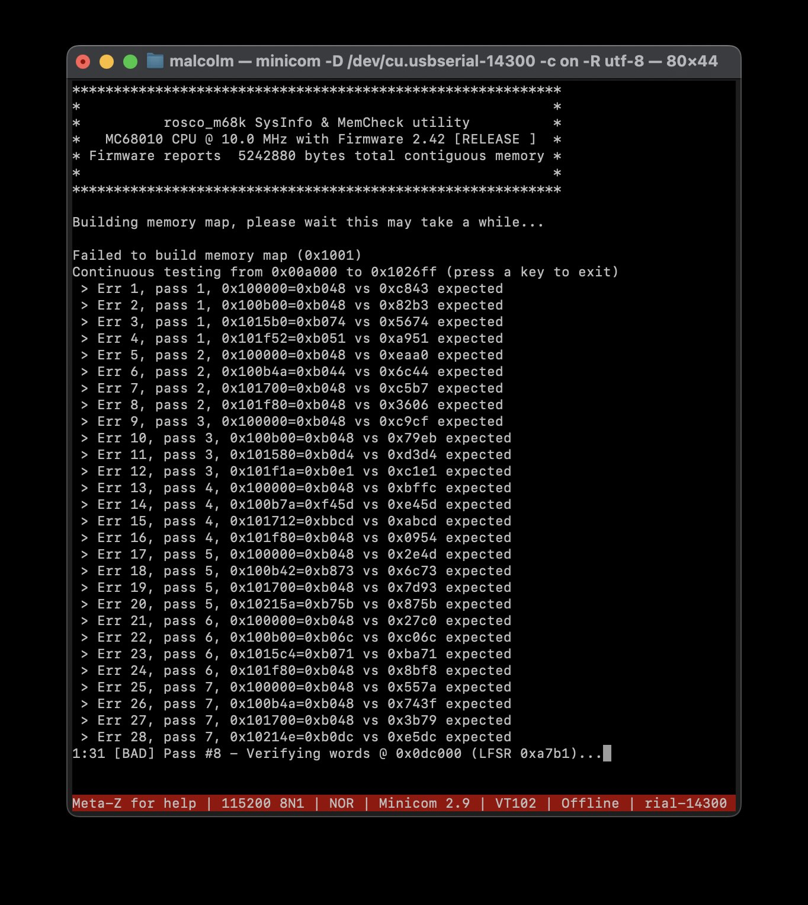

# simple_4Mb
A simple 4Mb RAM expansion card for the rosco sac.  Complicated only by the fact its mainly SMT ...

24th Feb 2025

The boards are back from jlcpcb.  The only potential issue is that I put the vias for the capacitors on the pad.  This seems to have worked by default without the expensive via in pad process.  The connections between the pads and VCC/GND check out ok.

Running on the 68030 rosco works fine!

.. but the board is struggling on the 68010, not sure why ?

11th Feb 2025 - Sent to jlcpcb

